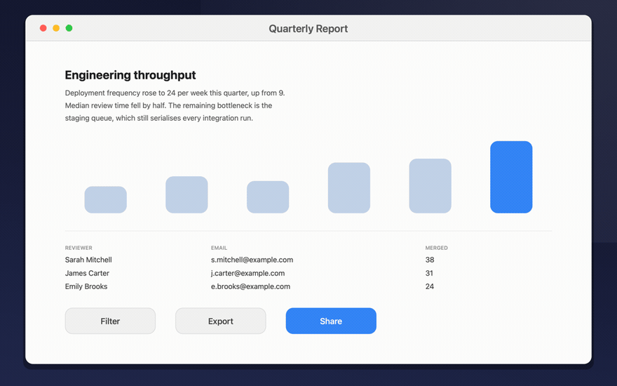

# Tyto



Region screenshots with markup, for macOS. Press ⌘⇧9 and the screen freezes immediately, so an
open menu or a mid-flight animation stays put while you pick what to keep. Drag a region, or
click a window to grab just that one. Mark it up, press Return, and it is on the clipboard.

Named after the barn owl, *Tyto alba*. It also sounds like "отуто", Ukrainian for "right
here", which is roughly what you mean when you drag a box around something.

## Download

Coming to the Mac App Store. Free, macOS 26 or later, Apple silicon.

<!-- On release, replace the line above with:
[](https://apps.apple.com/app/id6812734653)
-->

macOS asks for Screen Recording permission the first time. Grant it and relaunch.

## What it does

- Drag a region, or click a window to take just that window
- Seven drawing tools: box, ellipse, line, arrow, text, pixelate, numbered badges
- Return copies to the clipboard, ⌘S writes a PNG
- Every capture is also saved to `~/Pictures/Tyto`, last 24 in the menu bar, and it can be
  turned off
- Configurable shortcut, and default tool, colour and thickness

## No network, at all

Tyto contains no networking code. No uploads, no analytics, no account.
`grep -r URLSession Sources/` comes back empty, and the app is sandboxed with only four
entitlements: the sandbox itself, read/write to Pictures, user-selected files for the save
panel, and app-scoped bookmarks so a chosen save folder survives a restart.

The full privacy statement is at [tyto.random.travel](https://tyto.random.travel/privacy.html).

## Contributing

Tyto is a finished thing I use every day, released free on the Mac App Store. The source is
here so you can check that yourself, not because the repo needs maintainers. Bug reports are
welcome in [Issues](https://github.com/merksam/tyto/issues); pull requests may sit for a
while, so please open an issue before writing one.

If it saves you time:

[](https://ko-fi.com/merksam)
[](https://github.com/sponsors/merksam)

Entirely optional – nothing in the app asks.

## Building

Requires macOS 26 or later. Build with Xcode 27.

```bash
swift test              # unit tests, TytoCore only, no AppKit needed
scripts/dev.sh          # build Tyto.app, sign it, relaunch, wait for the debug socket
scripts/e2e-phase2.sh   # drive the real app on a second display; PNGs land in out/
scripts/gen-project.sh  # generate Tyto.xcodeproj from project.yml (for archiving)
```

`scripts/build-app.sh` signs with a Developer ID certificate if one is in the keychain, and
ad-hoc otherwise. macOS ties the Screen Recording grant to the signature, so an ad-hoc build
has to be re-approved on every rebuild.

## Layout

- `Sources/TytoCore`: pure model. Geometry, the selection state machine, the annotation
  document, undo history, and the renderer. No AppKit, and this is what the tests cover.
- `Sources/Tyto`: the app. Capture, the overlay windows, the toolbar, settings.
- `Sources/tytoctl`: a debug CLI that drives a running debug build over a unix socket, so the
  tests drive the real AppKit layer end to end. Compiled out of Release.

One renderer draws both the live overlay and the exported image, so the export cannot drift
from the preview. There is only one path.

## Licence

MIT. See [LICENSE](LICENSE).
